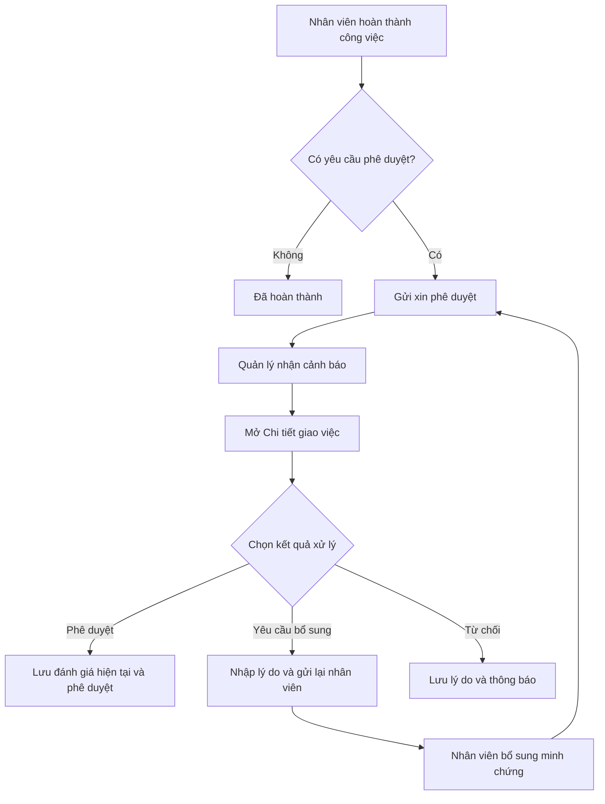

# Hướng dẫn luồng Xin phê duyệt – Đánh giá quản lý – KPI

Tài liệu này mô tả đúng luồng đang được sử dụng trong ứng dụng Vercel và giữ nguyên logic dữ liệu của Apps Script.

## 1. Luồng xin phê duyệt và phản hồi



### Nhân viên gửi xin phê duyệt

1. Mở **Giao việc & Nhắc việc**.
2. Mở **Sửa/Bổ sung** nếu cần nhập kết quả, ghi chú, ảnh hoặc tài liệu minh chứng.
3. Bấm **XIN PHÊ DUYỆT**.
4. Gõ tên quản lý, lọc và chọn người có **Chức vụ** phù hợp.
5. Nhập nội dung xin phê duyệt.
6. Bấm **GỬI XIN PHÊ DUYỆT**.

Trạng thái chuyển thành **CHỜ PHÊ DUYỆT** và cảnh báo xuất hiện trong màn hình chính của quản lý.

### Quản lý phê duyệt

1. Mở cảnh báo **CHỜ QUẢN LÝ PHÊ DUYỆT**.
2. Bấm **MỞ & XỬ LÝ** hoặc vào tab **XIN PHÊ DUYỆT**.
3. Kiểm tra toàn bộ tiêu đề, mô tả, bộ phận, người thực hiện, thời hạn, ghi chú, ảnh và tài liệu.
4. Chọn **Đánh giá quản lý hiện tại**.
5. Chọn một kết quả: **Đã phê duyệt**, **Yêu cầu bổ sung** hoặc **Từ chối**.
6. Nhập ý kiến nếu yêu cầu bổ sung hoặc từ chối.
7. Bấm **LƯU ĐÁNH GIÁ & PHÊ DUYỆT**.

Mọi cấp quản lý cùng xem một trường **Đánh giá quản lý hiện tại**. Mỗi lần đánh giá vẫn được lưu vào **Lịch sử phê duyệt và đánh giá**, gồm người đánh giá, chức vụ, kết quả, ý kiến và thời gian.

### Nhân viên nhận yêu cầu bổ sung

Khi quản lý yêu cầu bổ sung, cảnh báo ghi rõ việc cần làm. Nhân viên mở chi tiết, bổ sung nội dung hoặc tài liệu, sau đó bấm **GỬI XIN PHÊ DUYỆT** lại.

## 2. Trạng thái

Trạng thái công việc và trạng thái phê duyệt được tách riêng:

| Trạng thái công việc | Trạng thái phê duyệt |
|---|---|
| Chưa bắt đầu | Chưa xin ý kiến |
| Đang làm | Chờ phê duyệt |
| Đã hoàn thành | Đã phê duyệt |
| Quá hạn | Yêu cầu bổ sung |
|  | Từ chối |

## 3. Công thức KPI 100 điểm

```text
Tổng KPI = 100 + Điểm giao việc + Điểm bảng kiểm - Điểm vi phạm
```

- **Điểm giao việc**: lấy từ trường **Đánh giá quản lý hiện tại**.
- **Điểm bảng kiểm**: lấy từ tỷ lệ đạt và cấu hình của từng mẫu phiếu trong `DM_CAUHINH_PHIEU`.
- **Điểm vi phạm**: tổng điểm trừ trong danh mục lỗi và các vi phạm đã ghi nhận.
- Quy tắc xếp loại lấy từ `DM_QUYDOI_KPI`; không hard-code thay thế cấu hình cũ.
- Công việc **Chưa bắt đầu** không cộng điểm; đánh giá **Xuất sắc/Tốt/Khá/Chưa đạt-Làm lại/Kém/Quá hạn** được quy đổi đúng theo bảng Script.
- Mục **Nhắc việc/Ghi chú** không tham gia tính KPI.

## 4. Cảnh báo thao tác

- **Công việc mới**: mở chi tiết và cập nhật trạng thái đã nhận.
- **Công việc hôm nay/trong tuần**: kiểm tra tiến độ và thời hạn.
- **Công việc quá hạn**: cập nhật lý do hoặc trạng thái xử lý.
- **Chờ phê duyệt**: kiểm tra toàn bộ nội dung, chọn đánh giá rồi phê duyệt hoặc yêu cầu bổ sung.
- **Chờ phản hồi**: đọc ý kiến quản lý, bổ sung minh chứng và gửi lại.

